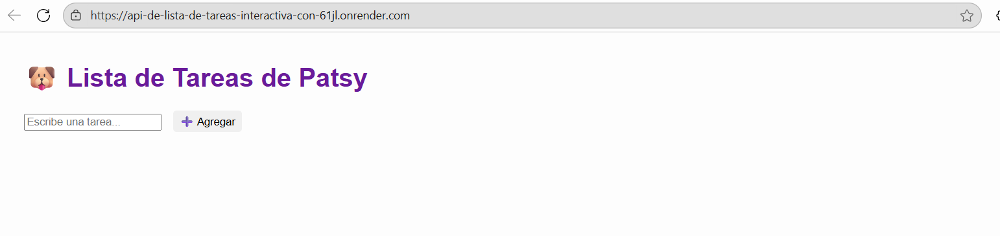

# API de Lista de Tareas Interactiva con Python y Flask

Lista de Tareas de Patsy 🐶
https://api-de-lista-de-tareas-interactiva-con-61jl.onrender.com/



Una pequeña app To-Do con **Flask + SQLAlchemy** y un frontend minimalista servido desde el propio backend.  
Deploy activo en Render y con soporte para potencial migración a Postgres (Neon).

---

##  Características

- API REST simple: `GET /todos`, `POST /todos`, `DELETE /todos/:position`
- Persistencia via SQLite (`todos.db`) por defecto
- Migrable a **Postgres (Neon)** usando `DATABASE_URL`
- CORS habilitado para desarrollo front-end (y SPAs externas)
- Front minimal en `/` (HTML + JavaScript)
- Deploy en Render con HTTPS y dominio público

---

##  Construcción local

```bash
git clone https://github.com/alejandrabarcena/API-de-Lista-de-Tareas-Interactiva-con-Python-y-Flask.git
cd API-de-Lista-de-Tareas-Interactiva-con-Python-y-Flask
python -m venv venv
# Windows PowerShell:
.\venv\Scripts\Activate.ps1
# unix/mac:
source venv/bin/activate
pip install -r requirements.txt
python app.py

Con eso, tu app correrá en: http://127.0.0.1:5000

Usar la app localmente
# Leer todos
curl http://127.0.0.1:5000/todos

# Crear una tarea
echo '{ "done": false, "label": "Pasear a Patsy" }' > body.json
curl -X POST http://127.0.0.1:5000/todos \
  -H "Content-Type: application/json" \
  --data-binary "@body.json"

# Borrar la primera
curl -X DELETE http://127.0.0.1:5000/todos/0
Deploy en Render

Build Command: pip install -r requirements.txt

Start Command: gunicorn -b 0.0.0.0:$PORT app:app

Health Check: /health

SQLite por defecto → listo sin variables de entorno

Para Postgres (Neon), agregar variable:
DATABASE_URL = postgresql+psycopg://...

Endpoints
Acción	Ruta	Descripción
Listar tareas	GET /todos	Devuelve array JSON
Crear una nueva	POST /todos	Requiere JSON body
Eliminar por índice	DELETE /todos/:position	Elimina tarea
Revisar estado servidor	GET /health	Devuelve { ok: true }
Credenciales

CORS abierto: apto para consumir con frontend separado

.gitignore ya cubre venv/, todos.db, etc.

Autora

Desarrollado con mucho cariño para Patsy, inspirado en su fuerza y ternura.
Por @alejandrabarcena — inspiración e impulso constantes.

Pro tip

Para visualizar tu README.md antes de subirlo a GitHub:

Usa Visual Studio Code (Ctrl+Shift+V)

O un editor online como StackEdit
